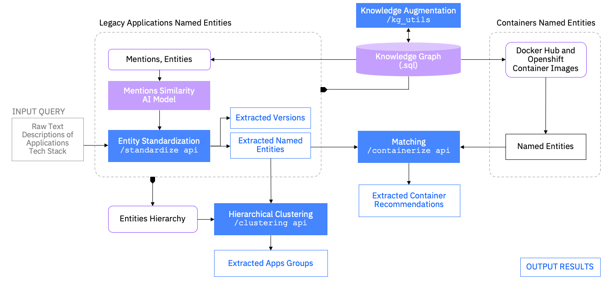

# Tackle Container Advisor (TCA)
## Table of Contents

### Usage
1. [TCA Pipeline](#TCA-Pipeline)
2. [Run TCA](https://konveyor.github.io/tackle-container-advisor-docs/docs/setup/)
3. [API description](https://konveyor.github.io/tackle-container-advisor-docs/docs/apis)
4. [References](https://konveyor.github.io/tackle-container-advisor-docs/docs/publications/)

### Development
1. [Knowledge Base](https://konveyor.github.io/tackle-container-advisor-docs/docs/kg/)
2. [Knowledge Base Utilities](https://konveyor.github.io/tackle-container-advisor-docs/docs/kgutils/)
3. [Entity standardizer](https://konveyor.github.io/tackle-container-advisor-docs/docs/standardizer/)
4. [Developer Guide](https://konveyor.github.io/tackle-container-advisor-docs/docs/development/)

## Purpose
TCA provides APIs to standardize natural language description of technology stack components, cluster a portfolio of technology stacks into similar technology stack groups, match technology stacks to docker, openshift or operator catalog images. 
```
1. App1: rhel, db2, java, tomcat
2. App2: .net, java, oracle db
3. App3: dot net, java, oracle dbms
```

TCA takes the following steps to recommend the containerization.

**Standardize**: Standardize natural language inputs to relevant named entities of technology stacks present in our knowledge base. For details on the knowledge base please check the *db* folder. For example, the inputs in *App1,App2,App3* get mapped as the following named entities.

```
1. App1: rhel: RedHat Enterprise Linux, db2: DB2, java: Java, tomcat: Apache Tomcat
2. App2: .net: .NET, java: Java, oracle db: Oracle DB
3. App3: dot net: .NET, java: Java, oracle dbms: Oracle DB
```

**Clustering**: Cluster the standardized technology stack components into groups of similar technology stacks. For example, the standardized technology stacks for *App1,App2,App3* get clustered into the two technology stack clusters.

```
1. Cluster1: {App1}
2. Cluster2: {App2, App3}
```

**Containerize**: Determines whether a technology stack is fully containerizable, partially containerizable or not containerizableat all. If a technology stack is recommended as fully or partially containerizable, it also generates container images based on DockerHub or Openshift image catalogs. It is also possible to provide custom user-defined catalogs for matching to catalog images. For example, if a user decides to generate DockerHub related images, then TCA generates the following images.

```
1. Cluster1: tomcat|https://hub.docker.com/_/tomcats
2. Cluster2: db2|https://hub.docker.com/r/ibmcom/db2
```

For OpenShift, TCA generates the following images.

```
1. Cluster1: tomcat|https://access.redhat.com/containers/#/registry.access.redhat.com/jboss-webserver-3/webserver31-tomcat8-openshift
2. Cluster2: db2|https://access.redhat.com/containers/#/cp.stg.icr.io/cp/ftm/base/ftm-db2-base
```

## TCA Pipeline



The pipeline ingests raw inputs from clients data and standardizes the data to generate named entities and versions. For standardizing or normalizing raw inputs we use a tf-idf similarity based approach. To find container images we represent images in terms of named entities as well. The normalized representation helps to match legacy applications with container images to suggest the best possible recommendations.

## Code of Conduct

Refer to Konveyor's [Code of Conduct page](https://github.com/konveyor/community/blob/main/CODE_OF_CONDUCT.md)
